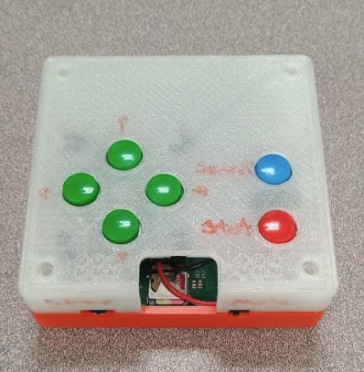
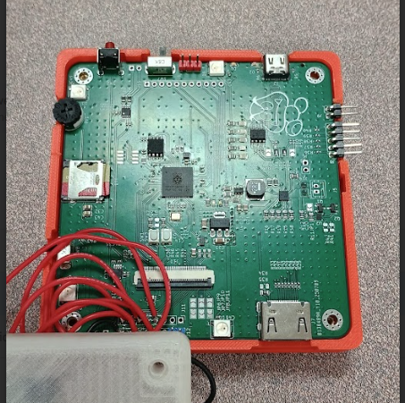

# TinyEngine

Introducing TinyEngine, this is a basic and small game engine for rendering 2D graphics to a framebuffer. The main use of this engine is currently on the RehabTendo at the Glenrose Rehabilitation Hospital. I created this as part of my Coop work term project, it uses a custom PCB fabricated to integrate different control methods for rehabilitation excersises.

Here is a prototype PCB and the first revision of the case design. 

## Features:
- Rechargable single cell battery support. With power path management and smart charging with safety timer.

- RP2350 dual core MCU with DVI output over HDMI and parrallel FPC connector for ILI or simalar parallel screens.

- Dual 8 Ohm speaker output with 5W max output power each. 

- 32 GB SD card game and asset storage

- Custom Bootloader with abilitty to load multiple games.

- 5V boost converter to power external controllers an peripherals from oboard battery.

- 4x WS2812B RGB LEDs chained from single PIO output

- 16MB flash storage.

- 2nd QSPI expansion for PSRAM or more flash.

- Dedicated mute and ON OFF switches with dedicated out of box reset switch.

- Many exposed headers for lots of different control methods.

- Dedicated debug LEDs.

## Repository and Layout:

The repository is structured to represent a conventional C++ program. src and inc folders have segragated headers and sources. Lib has all of the external libraries used.

## How to build:

This source is a static library and requires a sub project dependency to be ran. For Further guidence please view Confluence guides on compilation and flashing.